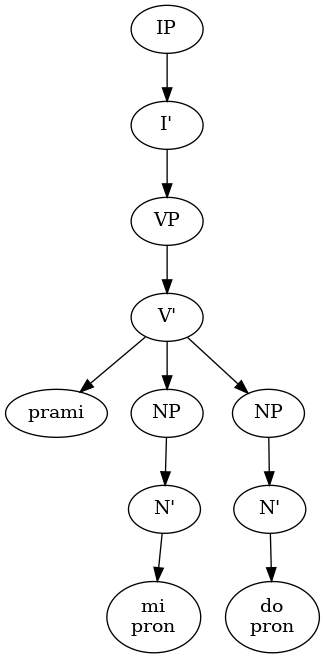
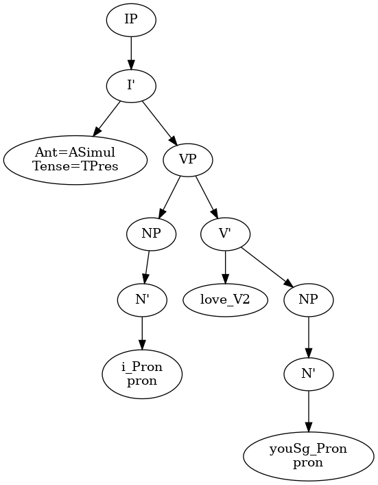

# Multilingual natural language generation

Generate text in several human languages from a single representation.

Unfortunately, the goal is not reached. Spin-offs of the project:

- [Collection of papers](./doc/papers/README.md)
- [Collection of resources](./resources/README.md)
- [python-lxslt](https://github.com/olpa/python-lxslt/): XSLT-like transformations over python lists
- [Lojban mapping to X-Bar trees](https://github.com/olpa/lojban-xbar/): Lojban mapping to X-Bar trees


# Pure interlingua is not enough

The first attempt was to develop rules that would convert from an interlingua to text. The assumption was:

> Target generation is in principle a solved problem if it starts from a formalized interlingua, since it can be performed by a deterministic program. (From "Abstract Syntax as Interlingua", see the [papers](./doc/papers/README.md))

The statement above isn't valid for multilingual targets. The human languages are different and you can't create an interlingua which is equally good for all of them. Your interlingua is a compromise, and you still have the old problems:

- Word sense disambiguation, now as the sense disambiguation of primitives (example: likely, you have only one primitive for "moon". But in Russian, there are two words for "moon", depending on its phase)
- Syntax construction choice (example: "green house" vs "house which is green")


# Fixture

Below are sentences that I tried to generate. Texts are reviewed by native speakers.

The first two examples are from the book "Machine Translation: A View from the Lexicon", another two examples are from the paper "Architecture for a multilingual Wikipedia". See the [papers](./doc/papers/README.md).

**Fixture 1**

- en: John broke into the room.
- es: Juan forzó la entrada al cuarto.
- de: Johann brach ins Zimmer ein.
- ru: Иван ворвался в комнату.
- zh: 约翰闯进了房间。
- jb: la djan. pu gutnerkla le kumfa

**Fixture 2**

- en: I stabbed John.
- es: Yo le di puñaladas a Juan.
- de: Ich stach Johann.
- ru: Я ударил Ивана ножом.
- zh: 我刺伤了约翰。
- jb: mi pu darxi la djan. le dakfu

**Fixture 3**

- en: San Francisco is the cultural, commercial and financial center of Northern California.
- de: San Francisco ist das kulturelle, kommerzielle und finanzielle Zentrum Nordkaliforniens.
- es: San Francisco es el centro cultural, comercial y financiero del Norte de California.
- ru: Сан-Франциско является культурным, коммерческим и финансовым центром Северной Калифорнии.
- zh: 旧金山是北加州的文化、商业和金融中心。
- jb: la sanfransiskos goi ko'a cu kulnu je canja je jdini midju la nosenkalifornos

**Fixture 4**

- en: It is fourth city of California by population, after Los Angeles, San Diego and San Jose.
- de: Es ist die viertgrößte Stadt in Kalifornien, nach Los Angeles, San Diego und San Jose.
- es: Es la cuarta ciudad de California por población, después de Los Ángeles, San Diego y San José.
- ru: Это четвертый по численности населения город в Калифорнии после Лос-Анджелеса, Сан-Диего и Сан-Хосе.
- zh: 它是加利福尼亚州人口第四大的城市， 仅次于洛杉矶，圣地亚哥和圣何塞。
- jb: ko'a ke ka ke ka la losangeles ce'o la sandi'egos ce'o la sanjoses lidne ke'e vomoi fi le xa'ugri ke'e tcadu la kalifornos


# How to run

The tool supports only a few examples and crashes for unknown input.

## Generate texts

```
$ docker run -it olpa/multi-nlg:try2021
lojban>>> mi prami do
zh: 我爱你。
ru: Я люблю тебя.
es: Yo te amo.
de: Ich liebe dich.
en: I love you.
lojban>>> anything unsupported
Traceback (most recent call last):
  File "/root/mnlg/gen.py", line 104, in <module>
    main()
    ...
```

## Show interlingua

```
$ echo "mi prami do" \
    | docker run -i olpa/multi-nlg:try2021 --lang en --end lcs \
    | sed 's/^lcs: //' \
    | tee lcs.json
["I-MAX", ["I-BAR", ["I"], ["V-MAX", ["V-FRAME", ["V", "prami
"], ["N-MAX", ["N-BAR", ["N", ["tag", "pron"], "mi"]]], ["N-M
AX", ["N-BAR", ["N", ["tag", "pron"], "do"]]]]]]]

$ cat lcs.json \
    | docker run -i --entrypoint "xbar_to_dot.py" olpa/multi-nlg:try2021 \
    | tee lcs.dot
digraph D {
node140448795431840 [label="IP"]
  140448795431312 [label="I'"]
  ...

$ dot lcs.dot -Tpng -olcs.png
$ xdg-open lcs.png
```



## Show D-Tree

In Khomsky theory, D-Tree is how the mind represents a sentence.

```
$ echo "mi prami do" \
    | docker run -i olpa/multi-nlg:try2021 --lang en --end dtree \
    | sed 's/^en: //' \
    | tee dtree.json
["I-MAX", ["I-BAR", ["I", ["tag", "Ant", "ASimul"], ["tag", "Te
nse", "TPres"]], ["V-MAX", ["V-SPEC", ["N-MAX", ["N-BAR", ["N",
["tag", "pron"], "i_Pron"]]]], ["V-BAR", ["V", "love_V2"], ["N-
MAX", ["N-BAR", ["N", ["tag", "pron"], "youSg_Pron"]]]]]]]

$ cat dtree.json \
    | docker run -i --entrypoint "xbar_to_dot.py" olpa/multi-nlg:try2021 \
    | tee dtree.dot
digraph D {
node140650929083296 [label="IP"]
  140650929082768 [label="I'"]
  ...

$ dot dtree.dot -Tpng -odtree.png
$ xdg-open dtree.png
```



## Re-build the tool

The tool is available on Docker Hub as "[olpa/multi-nlg:try2021](https://hub.docker.com/r/olpa/multi-nlg)", and also you can build the tool locally. One of the steps---linking the grammars---may take many minutes.

```
$ cd ...path.../multi-nlg/try2021
$ make docker
```

# Funding

To concentrate on the research and development, I need money: 200k€ for two years. Alternatively, you can contract me for NLG projects.

# Contact

Oleg Parashchenko, olpa@uucode.com
